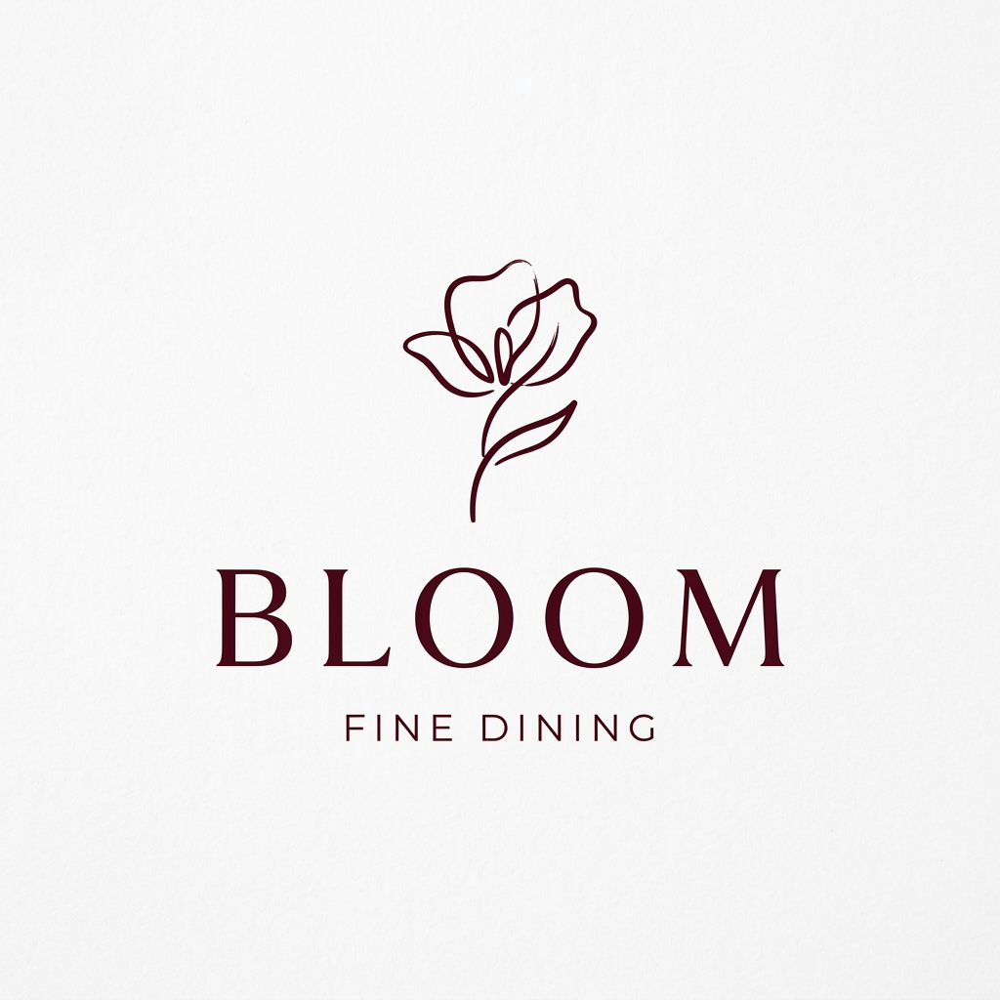
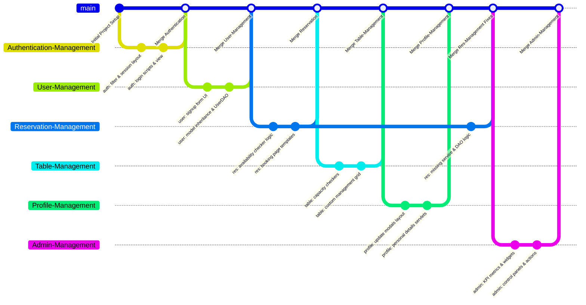

#  Bloom - Restaurant Table Reservation Platform

A premium, full-featured Restaurant Table Reservation Platform built as a Java Object-Oriented Programming (OOP) web application. The platform bridges the gap between sophisticated dining establishments and their guests, offering a seamless booking flow, visual table selection, user account self-service, and a master administrative control board.

---

## 📌 Table of Contents
* [📖 Project Description](#-project-description)
* [✨ Features](#-features)
* [🛠️ Technologies Used](#%EF%B8%8F-technologies-used)
* [🧩 OOP Concepts Demonstrated](#-oop-concepts-demonstrated)
* [📁 Project Structure](#-project-structure)
* [⚙️ Installation & Setup Guide](#%EF%B8%8F-installation--setup-guide)
* [📱 Screenshots & Visual Documentation](#-screenshots--visual-documentation)
* [🌿 Git Branch Strategy](#-git-branch-strategy)
* [👥 Contributors & Roles](#-contributors--roles)
* [🙏 Acknowledgments](#-acknowledgments)
* [📄 License](#-license)

---

## 📖 Project Description
**Bloom** addresses common friction points in standard restaurant management systems, such as double-booking conflicts, suboptimal table capacity mapping, and laggy administrative interfaces. Prioritizing robust backend logic and elegant interface aesthetics, the application applies strict Object-Oriented Programming (OOP) design patterns to provide an extensible, modular architecture that separates key domains—Authentication, Users, Tables, Reservations, Profiles, and Global Administration.

<div align="center">
  <blockquote>
    "An elegant dining experience begins long before you sit at the table. Bloom ensures the journey starts with ease, simplicity, and visual delight."
  </blockquote>
</div>

---

## ✨ Features

### 👤 Customer Features
* **🔐 Secure Authentication**: Multi-layered session management, custom password verification, and routing filters to prevent unauthorized access.
* **📝 Self-Registration**: Quick, interactive signup with autofocus forms and real-time input trim formatting.
* **📅 Smart Reservation Engine**: Real-time conflict resolution by validating date, time, and table availability, ensuring zero double-bookings.
* **👤 Interactive User Profile**: Complete dashboard to review, cancel, or modify active reservations, alongside real-time personal detail updates.

### 💼 Admin Features
* **📊 Visual KPI Metrics**: Core dashboard cards calculating real-time metrics, including active reservations, total customer accounts, occupied tables count, and total tables.
* **🎛️ Control Panel**: Full list structures with custom tabs for reservation oversight (approve/reject actions) and user account management.
* **🗃️ Table Inventory**: Complete administrator suite to add, modify, or delete dining tables with dedicated capacity and status controls.

---

## 🛠️ Technologies Used

| Category | Technology | Logo / Icon | Description |
|---|---|---|---|
| **Core** | **Java (JDK 17)** |  | Primary object-oriented logic & backend controller code. |
| **Web Server** | **Jakarta Servlet & JSP** |  | Dynamic request handling, filtering, routing, and UI rendering. |
| **Database** | **MySQL Server 8.0** |  | Relational database schema for secure, persistent storage. |
| **Server Engine** | **Apache Tomcat 9.0** |  | Local Servlet container and hosting server. |
| **Frontend Styling** | **HTML5 & Vanilla CSS** |  | Custom glassmorphism, responsive grids, and micro-animations. |

---

## 🧩 OOP Concepts Demonstrated

The core foundation of the **Bloom** system lies in the strict application of major Object-Oriented Programming (OOP) principles:

### 1. Encapsulation
Data hiding is enforced by keeping class properties `private` and exposing access strictly through standardized getter and setter methods. This safeguards the integrity of data within domain models.
```java
public class Reservation {
    private String reservationId;
    private String customerName;
    private String status;

    public String getReservationId() { return this.reservationId; }
    public void setReservationId(String reservationId) { this.reservationId = reservationId; }

    public String getStatus() { return this.status; }
    public void setStatus(String status) { this.status = status; }
}
```

### 2. Inheritance
Hierarchical structures eliminate code redundancy. The `User` class inherits shared identity fields from the base `Person` class, while specialized roles like `Admin` and `Customer` extend `User`.
```java
public class Person {
    protected String name;
    protected String email;
}

public class User extends Person {
    protected String id;
    protected String role;
}
```

### 3. Polymorphism
Polymorphic behavior is widely utilized through method overriding (e.g. standard Servlet `doGet` and `doPost` implementations) and dynamic method invocation within service layers.
```java
@Override
protected void doGet(HttpServletRequest request, HttpServletResponse response) 
        throws ServletException, IOException {
    List<Reservation> reservations = reservationService.getAllReservations();
    request.setAttribute("reservations", reservations);
    request.getRequestDispatcher("admin.jsp").forward(request, response);
}
```

### 4. Abstraction
High-level architectural contracts are defined via Service layers, keeping controller layers decoupled from the underlying DAO database operations.

---

## 📁 Project Structure
The organized directory structure of the Maven-based **Bloom** web application:

```text
RestaurantReservation/
├── src/
│   ├── main/
│   │   ├── java/
│   │   │   └── com/
│   │   │       └── restaurant/
│   │   │           ├── dao/          # Database Access Objects (UserDAO, ReservationDAO, TableDAO)
│   │   │           ├── model/        # Domain Models (Person, User, Admin, Customer, Reservation, Table)
│   │   │           ├── service/      # Business Logic Services
│   │   │           ├── servlet/      # Web Controllers (Login, Signup, Tables, MyAccount, ViewAll)
│   │   │           └── util/         # DBConnection, RoutingFilter, Test Utilities
│   │   └── webapp/
│   │       ├── WEB-INF/
│   │       │   ├── lib/              # Database Connector Libraries
│   │       │   └── web.xml           # Servlet Mappings & Routing Config
│   │       ├── css/                  # External stylesheets
│   │       ├── images/               # Project Visual Assets
│   │       ├── includes/             # Shared JSP Layouts (header, footer, update_modal)
│   │       ├── admin.jsp             # Administrative Dashboard
│   │       ├── my_reservations.jsp   # Customer self-service panel
│   │       ├── index.jsp             # Public landing page
│   │       ├── login.jsp             # System authentication portal
│   │       └── signup.jsp            # User registration portal
├── pom.xml                           # Maven Configuration
├── database_schema.sql               # MySQL Initialization Schema
└── README.md                         # Project documentation
```

---

## ⚙️ Installation & Setup Guide

### 📋 Prerequisites
* **Java Development Kit (JDK 17 or higher)**
* **Apache Tomcat 9.x**
* **MySQL Server 8.0**
* **Apache Maven 3.8+** or integrated IDE compiler (Eclipse, IntelliJ, NetBeans)

---

### 💻 Step-by-Step Installation

#### 1. Clone the Repository
```bash
git clone https://github.com/WJBiman/Restaurant-Table-Reservation-Platform-WD_261.git
cd Restaurant-Table-Reservation-Platform-WD_261
```

#### 2. Set Up Database Schema
Launch your MySQL command-line client or administration UI (e.g. Workbench), and run the SQL script to initialize tables:
```sql
CREATE DATABASE IF NOT EXISTS bloom_db;
USE bloom_db;
SOURCE database_schema.sql;
```

#### 3. Build & Package the Application
Use Maven to download dependencies and package the web application into a `.war` file:
```bash
mvn clean package
```

#### 4. Deploy to Apache Tomcat
* Copy the generated `RestaurantReservation.war` file from the `target/` directory.
* Paste it into the `webapps/` folder of your Apache Tomcat installation (or exploded context).
* Start the Tomcat server. The WAR file will automatically deploy and expand.

#### 5. Access the Application
Open your web browser and navigate to:
```text
http://localhost:8080/
```

---

## 📱 Screenshots & Visual Documentation

### 💻 Home Page
The public landing page introduces patrons to the Bloom fine dining experience, allowing them to search for tables, browse dining spaces, and initiate booking requests.
<p align="center">
  
</p>

### 🔐 Reservations / Bookings Page
A customer-facing dashboard that allows registered guests to view active and past bookings, update details, or cancel reservations securely.
<p align="center">
  
</p>

### 📊 Master Administrative Board
The central workspace for administrators. It details KPIs (active reservations, completed bookings, registered guests, and occupied tables) and includes table lists to approve, cancel, edit, or archive reservations.
<p align="center">
  
</p>

### 🗃️ Table Inventory
Displays the visual restaurant layout with details on table allocations, seating capacities, and locations.
<p align="center">
  
</p>

---

## 🌿 Git Branch Strategy

For organic and systematic parallel development, the group implemented a feature-branch separation strategy. All changes were isolated, tested, and resolved for Committer co-authorship before final integration:



* **`main` Branch**: Contains the stable, 100% integrated finished product.
* **Module Branches**: Dedicated feature development branches isolated by student member assignments (`Authentication`, `User`, `Reservation`, `Table`, `Profile`, `Admin`).

---

## 👥 Contributors & Roles

The project was completed through collaborative teamwork by **Group WD_261**:

| Member Profile | Student ID | Dedicated Git Branch | Primary Contributions & Roles |
|---|---|---|---|
| **Perera P.H.M** | `IT25103439` | `User-Management` | **User Domain Architecture**: Designed `User`, `Person`, `Admin`, and `Customer` model inheritance. Coded `UserDAO`, registration logic, and admin customer tables. |
| **Gajaweera G.A.S.N** | `IT25102707` | `Authentication-Management` | **Security & Access Control**: Designed application routing filters, session validators, secure signout flow, and Web configuration mappings. |
| **Siriwardana H.D.K.P** | `IT25101476` | `Reservation-Management` | **Booking Engine Logic**: Created reservation workflows, validation handlers for booking slots, and table availability models. |
| **Pushpakumara A.S.P.W.A** | `IT25103286` | `Table-Management` | **Table Inventory Subsystem**: Developed capacity checkers, administrator table controls, and service layers for table allocation. |
| **Chathushka A.H.S** | `IT25101421` | `Profile-Management` | **User Panel & Modals**: Built the responsive custom modals, personal information update servlet, and historical reservation list controllers. |
| **Warushawithana J.B** | `IT25100691` | `Admin-Management` | **Global Systems & Assets**: Coded the master administrative dashboard servlets, SQL schemas, public page assets, and global database connectors. |

---

## 🙏 Acknowledgments
* **Sri Lanka Institute of Information Technology (SLIIT)**: For the comprehensive OOP curriculum, guidelines, and assignment specifications.
* **Course Lecturers & Instructors**: For their invaluable feedback, mentoring, and support throughout the module lifecycle.
* **Open Source Community**: For the powerful tools and frameworks (Tomcat, Maven, MySQL) enabling student enterprise architectures.

---

## 📄 License
This project is licensed under the MIT License - see below details:

```text
MIT License

Copyright (c) 2026 Group WD_261

Permission is hereby granted, free of charge, to any person obtaining a copy
of this software and associated documentation files (the "Software"), to deal
in the Software without restriction, including without limitation the rights
to use, copy, modify, merge, publish, distribute, sublicense, and/or sell
copies of the Software, and to permit persons to whom the Software is
furnished to do so, subject to the following conditions:

The above copyright notice and this permission notice shall be included in all
copies or substantial portions of the Software.
```

## License
Distributed under the MIT License.

